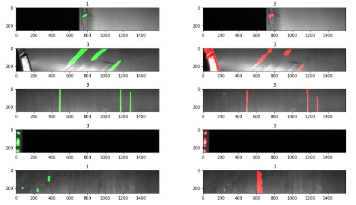
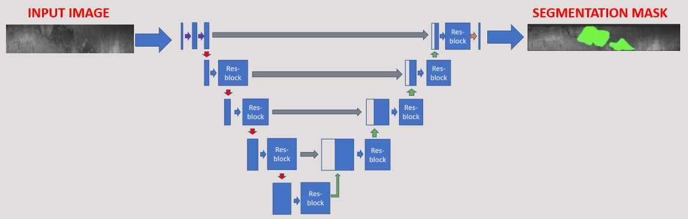
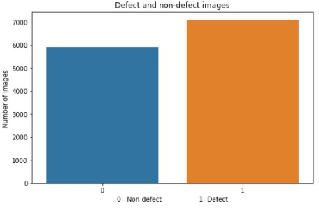
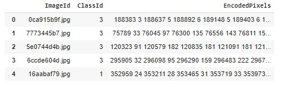
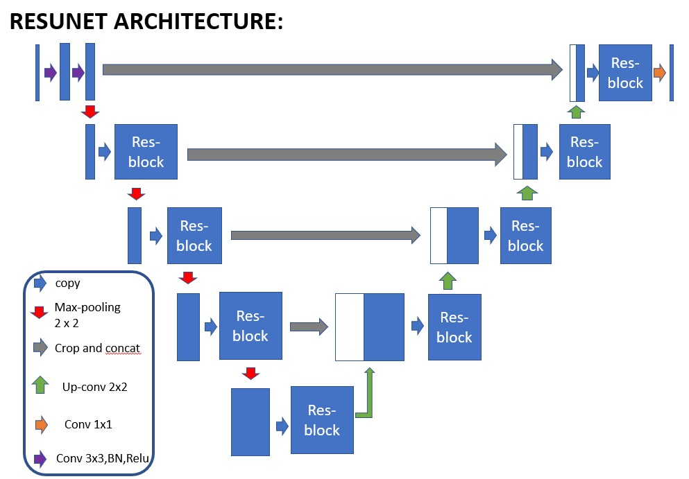
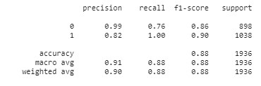

# Detect-and-localize-manufacturing-defects-from-images
Use ResNet50 deep learning model to predict defects on steel sheets and visually localize the defect using Res-UNET model.

This project aims to predict surface defects on steel sheets from images. This computer vision technique leverages transfer learning using pretrained ResNet50 model.
In case a default is detected, another model allows to visually show the detected defaults on the image (image segmentation). The second model generates a pixel-wise prediction to localize the defect on the image using a Res-U-net architecture. The models are developped with tensorflow Keras.

# Project description

The project comprizes two steps:
- Training and evaluation of a classification model to determine whether a steel sheet has a surface default of not. The model processes pictures of manufactured steel sheets and leverages a pre-trained ResNet50 model fined tuned on the target problem using an ad-hoc training dataset. The parts have 4 types of defect however this first step classifies parts as faulty / non faulty. Determination of the defect type is performed during image segmentation coming next.
- Training and testing image segmentation to localize defects on faulty sheets. This step uses a U-net model to predict whether each pixel of the image is part of the surface default or not. The output is the visualization of the defect identified by the model. This model is trained on an ad-hoc dataset. Additionally, the model predicts the type of defect between the 4 possible categories.

Illustration of image segmentation step on defective steel sheets:

The goal of image segmentation is to understand and extract information from images at the pixel-level. Image Segmentation can be used for object recognition and localization which offers tremendous value in many applications such as medical imaging or self-driving cars.

# Dataset

The project uses a training set of 13,000 RGB images (image size of 256 x 1600). The dataset is available at kaggle [here](https://www.kaggle.com/c/severstal-steel-defect-detection/data) and is provided in the context of a classification challenge. There are over 7,000 images with one or mutiple defect types. Defects are classified amongst 4 types with significant class imbalance (predominance of one defect type representing 73% of all defects). This obviously impacts the performance of the model to predict the correct type of defect. A model predicting all faulty parts to be of type n°3 will mechanically reach a accuracy of 73% on faulty parts. Class imbalance will also influence the learning phase and should be mitigated during training (data augmentation, class weight adjustment). This step is ignored with this toy dataset.

Dataset struture:

Steel sheets with defect type and localization:

The training set includes a mask localizing the default on the image for the faulty sheets. This mask is encoded using RLE (Run Length Encoding) which is a lossless compression technique to reduce storage requierements. RLE stores sequences containing many consecutive data elements as a single value followed by the count. This is particularly useful to compress image segmentation (binary representation at pixel level with '0' or '1' in our mask example here).

# ResNet50 Architecture

I covered the ResNet principles in a previous project 'Skin Cancer Classifier'. Those interested can check it out [here](https://github.com/LaurentVeyssier/Skin-Cancer-Classifier-Dermatologist-AI). To solve our problem, the classification section is replaced by a 2-ayer fully connected network after an average pooling layer. This custom section predicts if the proposed image as a default or not (1 or 0). This is a binary classification.

# U-Net Architecture

U-Net type of network are well adapted for segmentation tasks. In a segmentation analysis, the output must be of the same size as the input image. The output will be a mask determining the presence of a default or not (1 or 0 for each pixel coordinates). The mask can then be combined with the original image to highlight surface defects at the level of the pixel. For those interested, I covered a similar type of architecture in a previous project [here](https://github.com/LaurentVeyssier/Semantic-Segmentation-with-Fully-Convolution-Network) 

The U-Net model takes its name from the U-shape. The model has three distincts sections:
- Encoder or downsampling / contracting section
- Bottleneck section. Similar to autoencoders, the objective is to condense the image representation and capture only key features. The bottleneck forces this simplication.
- Decoder or upsampling / expanding section. The encoded image is upsampled back to the original size and captures the critical information to optimize the custom loss function. The output is a binary mask of same size as the original image. The mask localizes the presence of the default.

U-Net architecture is based on fully convolutional networks and modified in a way that performs well on segmentation tasks. In this Res-U-Net example, the U-Net architecture combines residual block technique to overcome vanishing gradient issues proper to deep architectures.

- Encoder: It consists of 4 blocks. First block consists of 3x3 convolution layer +  Relu + Batch-Normalization. Each following block takes an input that passes through residual-blocks followed by 2x2 max pooling. While max pooling performs downsampling in x and y dimensions, feature maps after each block doubles, which helps the model learn complex features 
- Bottleneck: The bottleneck block, serves as a connection between contraction path and expansion path. The block takes the input and then passes through a res-block followed by 2x2 up-sampling convolution layers.
- Decoder: Each block takes in the up-sampled input from the previous layer and concatenates with the corresponding output features from the res-blocks in the contraction path. This is then again passed through the res-block followed by 2x2 up-sampling convolution layers. This helps to ensure that features learned while contracting are used while reconstructing the image. Finally in the last layer of expansion path, the output from the res-block is passed through 1x1 convolution layer to produce the desired output with the same size as the input. This last convolution performs binary classification to produce the pixel-by-pixel mask through a sigmoid function.

# Results

The classification model reaches satisfying performance. F1 score above 0.86 and average accuracy of 88%. This performance is achieved by rejecting images with probability of default below 0.01 (1%) and classifying as faulty all above this threshold. A less strict threshold of 0.5 leads to an overall accuracy of over 97%. 

The segmentation model uses a custom loss function to address the pixel-wise classification. The project uses the `Focal Tversky Attention U-Net` function available [here](https://github.com/nabsabraham/focal-tversky-unet/blob/master/losses.py). @article{focal-unet, title={A novel Focal Tversky loss function with improved Attention U-Net for lesion segmentation}, author={Abraham, Nabila and Khan, Naimul Mefraz}, journal={arXiv preprint arXiv:1810.07842}, year={2018} }. The outcome is illustrated below:

In the segmentation step, the project applies the detection threshold of 0.01 once again, rejecting images with probability of default below the threshold and processing all other images for visualization of the detected faulty areas. Steel sheets classified as faulty are therefore identical in both steps.
