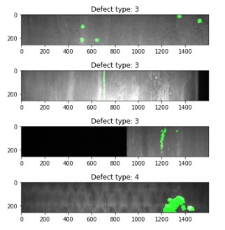

# Detect-and-localize-manufacturing-defects-from-images
Use ResNet50 deep learning model to predict defects in steel and visually localize the defect using Res-UNET model.

This project aims to predict manufacturing defects on steel parts from images. This computer vision technique leverages transfer learning using pretrained ResNet50 model.
In case a default is detected, another model allows to visually show the detected defaults on the image (image segmentation). The second model is built according to Res-UNET principles in order to generate a pixel-wise prediction to localize the defect.

# Project description

The project comprizes several steps:
- Classification model to determine whether a steel part has a default of not. The model uses pictures of steel parts. Parts have defects 

