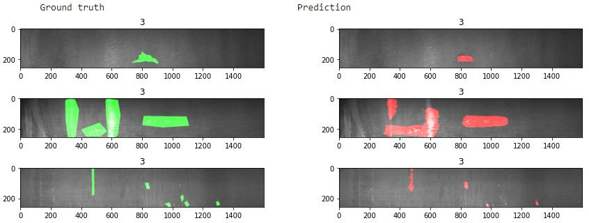

# Detect-and-localize-manufacturing-defects-from-images
Use ResNet50 deep learning model to predict defects on steel sheets and visually localize the defect using Res-UNET model.

This project aims to predict surface defects on steel sheets from images. This computer vision technique leverages transfer learning using pretrained ResNet50 model.
In case a default is detected, another model allows to visually show the detected defaults on the image (image segmentation). The second model generates a pixel-wise prediction to localize the defect on the image using a Res-U-net architecture.

# Project description

The project comprizes two steps:
- Classification model to determine whether a steel sheet has a surface default of not. The model processes pictures of manufactured steel sheets and leverages a pre-trained ResNet50 model fined tuned on the target problem using an ad-hoc training dataset. The parts have 4 types of defect however this first step classifies parts as faulty / non faulty. Determination of the defect type is performed during image segmentation coming next.
- Image segmentation to localize the defects on the image of faulty sheets. This step uses a U-net model to predict whether each pixel of the image is part of the surface default or not. The output is the visualization of the defect identified by the model. This model is trained on an ad-hoc dataset. Additionally, the model predicts the type of defect between the 4 possible categories.

Illustration of image segmentation step on defective steel sheets:

# Dataset

The project uses a training set of 13,000 RGB images (image size of 256 x 1600). The dataset is available at kaggle [here](https://www.kaggle.com/c/severstal-steel-defect-detection/data) and is provided in the context of a classification challenge. There are over 7,000 images with one or mutiple defect types. Defects are classified amongst 4 types with significant class imbalance (predominance of one defect type representing 73% of all defects). This obviously impacts the performance of the model to predict the correct type of defect. A model predicting all faulty parts to be of type n°3 will mechanically reach a accuracy of 73% on faulty parts. Class imbalance will also influence the learning phase and should be mitigated during training (data augmentation, class weight adjustment). This step is ignored with this toy dataset.

Dataset struture:

Steel sheets with defect type and localization:

The training set includes a mask localizing the default on the image for the faulty sheets. This mask is encoded using RLE (Run Length Encoding) which is a lossless compression technique to reduce storage requierements. RLE stores sequences containing many consecutive data elements as a single value followed by the count. This is particularly useful to compress image segmentation (binary representation at pixel level with '0' or '1' in our mask example here).

# U-Net model

# Results

After limited training (40 epochs), the classification model reaches satisfying performance. F1 score over 0.86 and average accuracy of 88%.

The segmentation model uses a custom loss function to address the pixel-wise classification. The project uses the `Focal Tversky Attention U-Net` function available [here](https://github.com/nabsabraham/focal-tversky-unet/blob/master/losses.py). @article{focal-unet, title={A novel Focal Tversky loss function with improved Attention U-Net for lesion segmentation}, author={Abraham, Nabila and Khan, Naimul Mefraz}, journal={arXiv preprint arXiv:1810.07842}, year={2018} }. The outcome is illustrated below:

